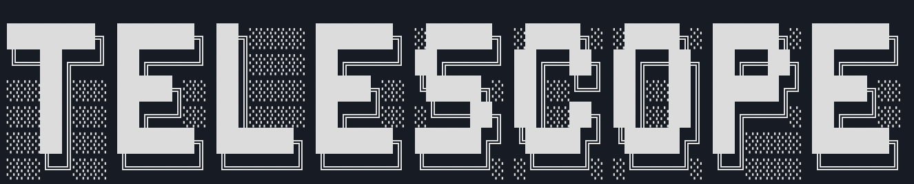
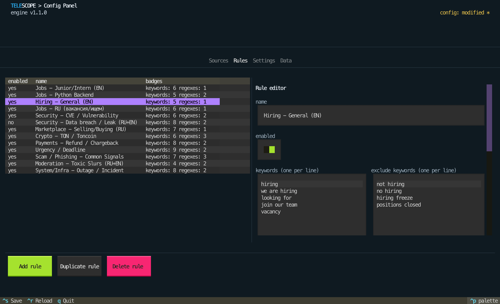

# Telescope

**Threat Intelligence & OSINT detection platform for Telegram.**


Telescope watches the Telegram channels you already have access to, applies your
rules in real time, and pushes structured matches into your SIEM, chat, or
ticketing pipeline. It is built for security teams who treat Telegram as a
first-class collection source - 0-day chatter, Initial Access Broker listings,
ransomware leak sites, CVE discussion, credential dumps, and the malware-as-a-
service ecosystem.

It is the collection and detection layer that **feeds** your
SIEM (Splunk, Elastic, Sentinel) or your incident response stack (MISP, TheHive,
PagerDuty, Slack).

> **Read [`ETHICAL_USE.md`](ETHICAL_USE.md) before using Telescope.** This tool only
> sees channels your account already sees. Do not use it for surveillance,
> harassment, or any non-defensive purpose.

---

## Why Telegram

Telegram crossed **1 billion monthly active users** in March 2025 and continues
to grow at roughly 2.5M new users per day, with **~500M DAU** as of 2026. That
scale alone makes it a Tier-1 collection source - but for threat intelligence,
the more decisive shift happened on the supply side.

After the **2025 BreachForums takedown** and the broader pressure on legacy
underground forums (RaidForums, RAMP, etc.), criminal activity migrated to
Telegram nearly overnight - channels and bots filled the vacuum within weeks.
Despite Telegram removing **43.5M channels and groups in 2025**, the same
actors reappeared under new handles within days. Industry consensus from
[Flare](https://flare.io/learn/resources/blog/the-undergrounds-favorite-messenger-telegrams-reign-continues/),
[CYFIRMA](https://www.cyfirma.com/research/telegram-as-the-new-operational-layer-of-cyber-threat-activity/),
and [The Hacker News](https://thehackernews.com/expert-insights/2026/03/telegrams-crackdown-changed-how-threat.html)
is that Telegram has become the **operational layer of the cybercriminal
ecosystem** - not as a replacement for the dark web, but as its primary
real-time communication and commerce surface.

Specifically, Telegram concentrates the kinds of activity TI teams care about:

- **Initial Access Brokers (IAB)** post corporate VPN/RDP/AD access listings
  with victim industry + revenue + geography characterization
- **Ransomware groups** (LockBit, Cl0p, BlackCat, Akira, RansomHub, etc.)
  operate leak-site announcement channels and affiliate-recruitment bots
- **Exploit marketplace chatter** - lower-tier direct sale offers, broker
  acquisition posts, and discussion of public PoCs / in-the-wild
  exploitation. (Telescope catches the commercial-tier chatter layer, not nation-state-grade
  private deals.)
- **Stealer-log economies** - RedLine, Lumma, Vidar, Stealc logs sorted by
  corporate SSO target (Okta, Azure AD, M365, AWS, Salesforce)
- **Credential dumps & combolists** - UHQ/HQ combolists, fresh database
  drops, session/cookie marketplaces (post-Genesis Market)
- **Phishing infrastructure** - kit sales, AitM panels (EvilGinx, Tycoon 2FA,
  EvilProxy), bulletproof SMTP, smishing kits, typosquat coordination
- **Malware-as-a-Service** - RedLine/Lumma subscriptions, Cobalt Strike
  cracked builds, FUD crypter services, RAT panels
- **Supply-chain compromise rebroadcast** - discussion of malicious
  npm/PyPI packages, maintainer hijacks, trojanized GitHub repos.
  (Primary discovery happens at [Socket](https://socket.dev/),
  [Phylum](https://www.phylum.io/), Snyk, GuardDog, and Unit 42 - e.g.
  Socket attributed 1,700+ malicious packages to DPRK actors in 2025.
  Telegram is the secondary amplification surface; Telescope catches the
  Telegram-side discussion, not the original detection.)

Three structural properties make Telegram especially attractive for both
sides - actors and defenders:

- **Broadcast-first format** - public channels are crawlable via the API,
  joinable by anyone with the link, and don't require invites the way
  Discord or closed forums do. This is what makes large-scale TI
  collection feasible.
- **Bot ecosystem & automation** - escrow bots, marketplace listing bots,
  affiliate-onboarding bots run entirely inside Telegram, so the full
  transaction trail is observable.
- **Persistent surface area** - even with **43.5M moderation actions in
  2025**, actors persist through rapid re-creation. The market hasn't
  fragmented to a competitor; it has stayed on Telegram.

Honest framing: Telegram is **a primary TI source, not the only one**. It
sits alongside dark-web markets, paste sites, and traditional underground
forums. Telescope's output feeds your SIEM or TIP
([Splunk](https://splunkbase.splunk.com/), [MISP](https://www.misp-project.org/),
[TheHive](https://thehive-project.org/), etc.) where it joins signals from
your other sources.

---

## What it does

- **Real-time rule matching** on incoming messages across many channels at once
- **Tag-based severity** (`severity:critical|high|medium|low`) and free-form
  categorization (`category:`, `actor:`, `family:`, `mitre:`, anything you want)
- **Three delivery paths**: Telegram Saved Messages, Telegram Bot, or generic
  **HTTP webhook** with structured JSON (Slack / Discord / Splunk HEC / Sentinel
  / TheHive / custom intake)
- **Curated threat packs** for the most common TI scenarios (see below)
- **SQLite audit log** of every match - `id`, source, rule, reason, tags,
  snippet, permalink - exportable to JSON or CSV
- **Content deduplication** so re-broadcasts and copy-paste don't generate
  duplicate tickets
- **Forum topic awareness** - monitor a single topic in a large supergroup
- **Catch-up scan** at startup so you don't miss matches during downtime
- **TUI** (`telescope config`) for editing rules, sources, and notification
  settings without touching JSON

---

## Use cases

| Use case | Pack |
|---|---|
| Exploit marketplace & 0-day chatter (sale offers, brokers, public PoCs, 0-click) | `examples/threat-packs/0day-marketplace.json` |
| Initial Access Broker (IAB) listings (VPN/RDP/AD/stealer-log access) | `examples/threat-packs/iab-listings.json` |
| Ransomware leak-site & affiliate activity (LockBit, Cl0p, BlackCat, Akira, RansomHub, …) | `examples/threat-packs/ransomware-leaks.json` |
| CVE chatter & active-exploitation signals (for your stack) | `examples/threat-packs/cve-chatter.json` |
| Credential dumps & combolist drops (UHQ/HQ combos, DB leaks, session/cookie shops) | `examples/threat-packs/credential-leaks.json` |
| Malware-as-a-Service (stealers, loaders, crypters, RATs) | `examples/threat-packs/malware-raas.json` |
| Phishing infrastructure (kits, AitM/MFA-bypass, SMTP, smishing, typosquats) | `examples/threat-packs/phishing-infrastructure.json` |
| Brand / executive / customer-data monitoring (template - fill in your identifiers) | `examples/threat-packs/brand-monitoring.json` |
| Supply-chain compromise rebroadcast (npm / PyPI / GitHub) | `examples/threat-packs/supply-chain-compromise.json` |
| ICS / SCADA / OT / critical-infrastructure targeting | `examples/threat-packs/ics-scada.json` |
| Non-TI monitoring (jobs, outages, scams, moderation) | `examples/general-purpose-rules.json` |

Each pack is a partial config - drop the rules into your `config.json`'s
`rules[]` array (or merge them via the TUI).

---

## Architecture


Telethon connects to Telegram over MTProto with your own user session, so
Telescope only ever sees channels your account is already in. Every incoming
message flows through a small SIEM-style core: source allow-list →
per-source idempotency → multi-signal rules engine (with `severity:` and
`mitre:` tags) → content deduplication → append-only audit log in SQLite →
notifier. Three pluggable delivery adapters (Saved Messages, Bot, Webhook)
sit behind a single `NotifierPort`, so structured matches can fan out to
your SIEM, MISP/TheHive, or any HTTP endpoint without touching the core.

Three explicit layers keep the detection core independent of Telegram and SQLite:

```
src/core/        - rules engine, dedup, message processor, models
src/adapters/    - Telegram (Telethon) mapping/notifiers, SQLite storage, webhook
src/app.py       - CLI, wiring, lifecycle
src/frontend/    - Textual TUI (rules editor, data browser, settings)
```

Adding a new delivery channel = one file in `src/adapters/` that implements
`NotifierPort`. Adding new storage = one file that implements `StoragePort`.

---

## Install

For Linux
```bash
python -m venv .venv
source .venv/bin/activate
pip install -r requirements.txt
pip install -e .
```

For Windows
```bash
python -m venv .venv
.\.venv\Scripts\activate
pip install -r requirements.txt
pip install -e .
```

## Configure

1. Copy and fill the env file:
   ```bash
   cp .env.example .env
   ```
   Get `API_ID` and `API_HASH` from <https://my.telegram.org>.

2. Copy the example config and edit it:
   ```bash
   cp config.example.json config.json
   ```
   `config.json` is gitignored so your sources and tokens never leave your machine.
   The minimal shape:
   ```json
   {
     "sources": [
       { "source_key": "@example_channel", "alias": "Example", "enabled": true }
     ],
     "rules": [
       {
         "name": "CVE mention",
         "regex": ["\\bCVE-\\d{4}-\\d{4,7}\\b"],
         "tags": ["severity:medium", "category:cve"],
         "enabled": true
       }
     ],
     "notifications": { "notification_method": "saved_messages", "snippet_chars": 400 },
     "dedup": { "mode": "per_source", "only_on_match": true, "ttl_days": 30 },
     "catch_up": { "enabled": true, "messages_per_source": 50 }
   }
   ```

3. (Optional) Merge one or more threat packs:
   ```bash
   cat examples/threat-packs/cve-chatter.json
   # copy the rules[] entries into config.json's rules[] array
   ```
   Or use the TUI: `telescope config` → Rules tab → Add rule.

### Source keys

| Form | Use when |
|---|---|
| `@channel_username` | Public channels / groups (lowercase) |
| `chat_id:-100123…` | Private supergroups / channels |
| `@channel#topic:42` | Single forum topic in a public chat |
| `chat_id:-100…#topic:42` | Single forum topic in a private chat |

To discover `chat_id:` values for private groups you've archived:
```bash
telescope discover
```

### Tag conventions

Tags are free-form strings, but two prefixes are recognized:

- `severity:critical|high|medium|low` → adds `[CRITICAL]` / `[HIGH]` / etc. to
  the alert header
- Everything else (`category:cve`, `actor:lockbit`, `family:lumma`,
  `mitre:T1566`, `priority:p1`) is propagated to the alert, the SQLite row, and
  the webhook payload - but doesn't trigger any built-in behavior

This keeps the schema flat and lets each team decide its own taxonomy.

---

## Run

```bash
telescope run
```

## TUI



```bash
telescope config
```

Tabs:
- **Sources** - add/edit/disable channels, set aliases
- **Rules** - full rule editor with inline tester (paste text, see which rules match)
- **Settings** - dedup, notification method, webhook URL/headers/timeout, logging
- **Data** - browse historical matches, filter by tag (e.g. `severity:critical`),
  export to JSON/CSV

---

## Delivery: webhook integration

Set `notification_method` to `webhook` and configure the destination:

```json
"notifications": {
  "notification_method": "webhook",
  "webhook_url": "https://hooks.example.com/intake",
  "webhook_headers": { "Authorization": "Bearer ..." },
  "webhook_timeout": 5.0,
  "snippet_chars": 400
}
```

Each match is POSTed as JSON:

```json
{
  "source_key": "@channel",
  "source_alias": "Underground channel",
  "chat_id": 1234567890,
  "message_id": 42,
  "date": "2026-06-04T10:15:00+00:00",
  "rule_name": "Initial Access Broker listings",
  "reason": "keyword(s): vpn access for sale\nregex: \\b(vpn|rdp)...",
  "tags": ["severity:critical", "category:iab"],
  "text_snippet": "Selling Fortinet VPN access to a US manufacturing company...",
  "text": "Selling Fortinet VPN access...",
  "permalink": "https://t.me/c/1234567890/42"
}
```

### Integration recipes

- **Splunk HEC**: point `webhook_url` at `https://splunk.example/services/collector/event`
  and set `Authorization: Splunk <token>` in `webhook_headers`.
- **Slack**: use a Slack webhook URL directly. (For richer formatting, run the
  webhook through a small bridge that maps Telescope's payload to Slack blocks.)
- **MISP / TheHive**: forward to a small relay (e.g. n8n, Pipedream, or a 30-line
  Flask app) that maps Telescope's JSON to a MISP event or a TheHive alert.
- **Custom**: any HTTP endpoint that accepts a JSON POST will work.

### Telegram delivery (alternative)

- `notification_method: "saved_messages"` - send to your own Saved Messages
  (zero setup, good for solo use).
- `notification_method: "bot"` with `BOT_API` in `.env` and
  `notifications.bot_chat_id` set - route through a Telegram bot (good for
  team channels).

---

## Session login

Telescope authenticates with your **user-session** (not a bot token) so it can
read channels your personal account is in. On first run it creates a local
`.session` file via Telethon.

Login methods:
- **QR code** (default, recommended)
- **Phone code** (SMS / Telegram code)

Optional env overrides:
- `LOGIN_METHOD=qr` or `LOGIN_METHOD=phone`
- `PHONE=+1234567890`
- `2FA=your_password`

If SMS codes do not arrive (a known issue in some regions), use the QR flow.

> **The `.session` file is a credential.** Treat it like a private key.
> See [`ETHICAL_USE.md`](ETHICAL_USE.md) for full operational guidance.

---

## Roadmap

Possible additions, driven by community feedback:

- STIX 2.1 / MISP-event export format
- Pluggable enrichment hooks (GeoIP, WHOIS, Tor onion lookup)

If you want one of these, open an issue with your use case.

---

## License

Apache-2.0. See `LICENSE`. Use is governed by [`ETHICAL_USE.md`](ETHICAL_USE.md).
